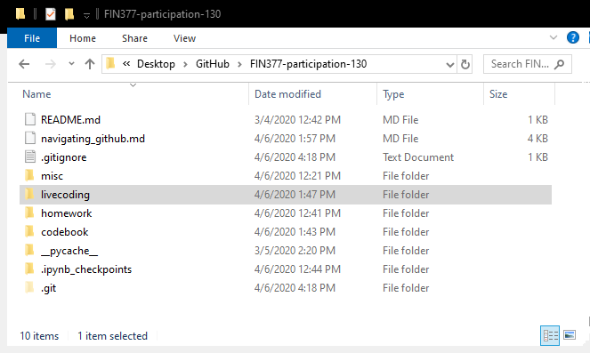
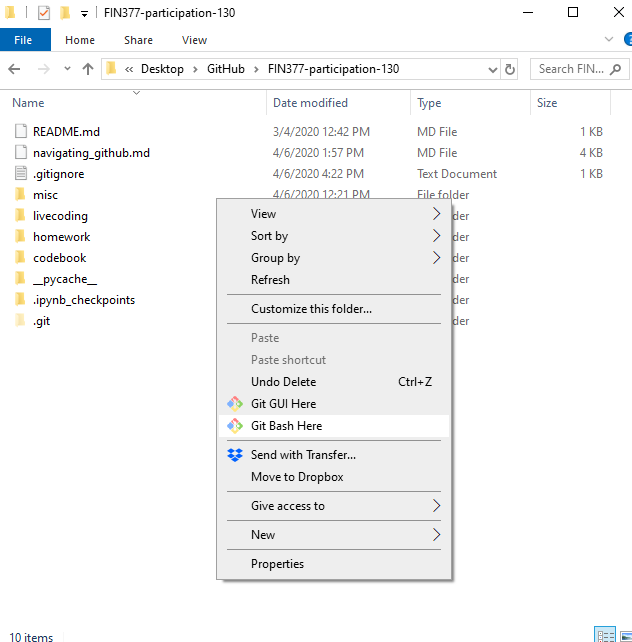
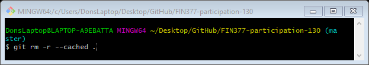
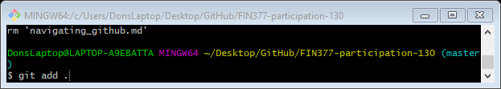
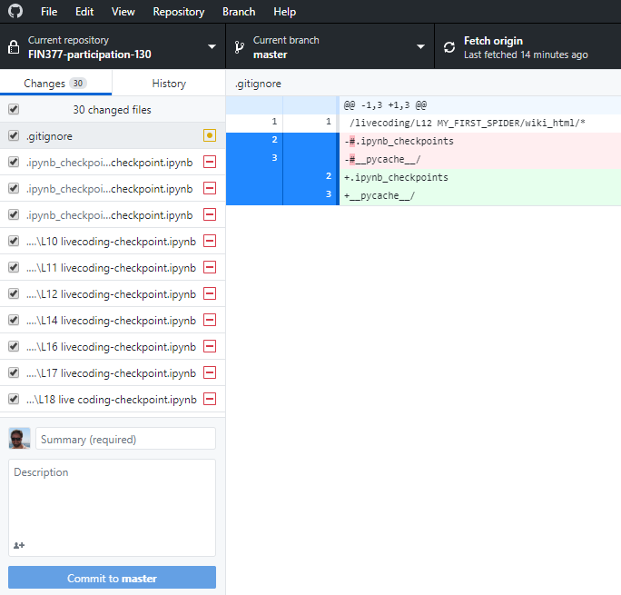
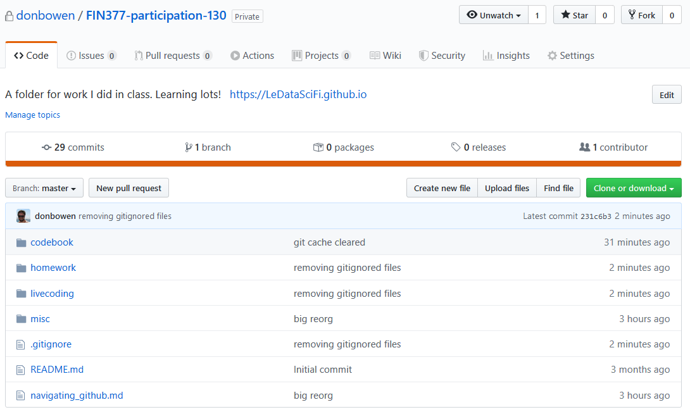

## In your participation folder, you should see

| File or Folder | Description | Requirements |
| :--- | :--- | :--- |
README.md |   What visitors see when they open the repo   |  It should be comprehensive and efficiently introduce any visitor to the content of the repo <br> <br> It can't be default / blank!
navigating_github | | This file was started [in lecture 01/01](https://ledatascifi.github.io/lectures-spr2020/01/01_Motivation_and_Getting_Started.html) and modified [in lecture 01/02](https://ledatascifi.github.io/lectures-spr2020/01/02_Jupyter_Basics.html) and [in lecture 01/03](https://ledatascifi.github.io/lectures-spr2020/01/03_Digging_into_Py.html) and [in lecture 02/01](https://ledatascifi.github.io/lectures-spr2020/02/01_Numpy.html). _(Those aren't dates but module #/lec# from the class URLs)_ <br> <br> **Must contain** <br> - Three markdown features (per 01/03 notes) <br> - Section with useful URLS (per 01/01 lecture)  <br> - Section with "How to" notes for your own benefit. (per 01/03 notes) <br> - Golden Rules per the 02/01 [lecture](https://ledatascifi.github.io/lectures-spr2020/02/01_Numpy.html) <br> - At the bottom of that table, add a new row: the first column should say "Randoms" and the second column should say "NEVER DRAW RANDOM NUMBERS WITHOUT A SEED".
codebook | A folder for cheat sheets, and reusable code snippets, like a recipe book | Contains `My personal python cheatsheet.ipnyb` which contains whatever you found useful
homework | A folder for homework and after class practice files | Contains `01a-numpy-practice.ipynb`, which (1) you download  [here](https://github.com/LeDataSciFi/lectures-spr2020/blob/master/content/02/01a-numpy-practice.ipynb) and (2) **solve the prompts within**
livecoding | A folder for our livecoding files |  See below
.gitignore | So the GH master repo doesn't have unnecessary files | **After I finished all the changes above on my computer**, my folders looked like the pictures on the left, below. But I didn't want to upload all of those to the remote GH repo. So I modified this file to include: <br><br> ```/livecoding/L12 MY_FIRST_SPIDER/wiki_html/*``` <br> ```.ipynb_checkpoints``` <br>  ```__pycache__/``` <br> <br> These will prevent github from uploading any files in the pycache and wiki_html folders, along with any ipnyb check files (from any folder). <br><br> Your steps: <br> 1. Add those to your gitignore file. <br> 2. Add any other folders or file types you have on your computer but don't want to upload or backup. <br> 3. Some files in your gitignore might already be uploaded to the remote repo. To remove those from the remote repo (but not your computer), follow the steps [below](#before-and-after-the-gitignore-is-altered-and-updated).
misc | A folder for files that aren't listed above but that you want to keep | None. This folder is entirely voluntary.

## Before and after the gitignore is altered and updated

Before, this is my participation folder on my computer and on GH:



_**Dan: These pictures will work in the assignment folder of the main website**_

Steps:
1. Open git in the folder where you want. Below, in Windows, I right clicked in the participation folder and clicked “Git Bash Here”. If you can’t do this, you can open Powershell/Terminal, and use the `cd “<path>”` command.
      
2. Put `git rm -r --cached .` in git bash/terminal/powershell and hit enter.
      
3. Put `git add .` in git bash/terminal/powershell and hit enter.
      
4. Open Github Desktop, summarize the commit (e.g. “removing gitignored files”), and push. In the screenshot below, notice how github is preparing to delete all the checkpoint files.
      
5. Now my online github repo is much cleaner!
      

## The `livecoding` folder

Instructions:
1. **All files should be run so that output is visible in them without running them!** If errors stop the code from running at a point, that is okay, as long as the code shows sufficient effort throughout.
2.  **Rename the files as I did.** The new file names are meaningful (and so will help you look through later!) and have a better numbering system (and so will help us grade them).
3. **Follow the requirements in the table below**

| File | Requirements | Notes |
| :--- | :--- |  :--- |
`L02 first_python_code.ipynb` | Effort check | Used to be called `In Class Lecture 2`
 `L02a a-simple-program.ipynb`|  | Professor Bowen provided this code
`L03 Py Basics.ipynb` | **Will check for:** at least 2 examples of each operation covered during this lecture | Used to be called `Class 3 live coding`
`L04 intro_to_numpy.ipynb` | Effort Check |  
`L05 pandas baby_names FRED.ipynb` | **Will check for:** a few uses of pandas and baby names code |
`L07 plotting diamonds and stocks.ipynb` | Effort Check|
`L09 better viz.ipynb` |Effort Check |
`L10 merging.ipynb` | **Will check for:** Merges attempted using datasets from this [lecture](https://ledatascifi.github.io/lectures-spr2020/02/05_outro.html)|
`L11 APIs.ipynb` | Effort Check|
`L12 URLs for SP 500.ipynb` |Effort Check |
`L12 MY_FIRST_SPIDER` | Effort Check| This is a folder that contains `wiki_sp500_scraper.ipynb`
`L14 regex and near regex.ipynb` | Effort Check|
`L16 diamonds regression.ipynb` | Effort Check|
`L17 reg and viz.ipynb` | Effort Check|
`L18 regression interpretation.ipynb` |**Will check for:** At least two regressions run with some sort of interpretation|
`L20 sklearn intro.ipynb` | Effort Check |
`NEAR_regex.py` | | Provided by Professor Bowen

# Homework
Pandas practice from end of this [lecture](https://ledatascifi.github.io/lectures-spr2020/02/02_Pandas.html)

Visualization practice from end of this [lecture](https://ledatascifi.github.io/lectures-spr2020/02/03_Making_Some_Viz_Happen.html)

Rewriting Q1-Q4 using requests.html from this [lecture](https://ledatascifi.github.io/lectures-spr2020/03/01_Intro_to_scraping.html)

Tesla regex practice from this [lecture](https://ledatascifi.github.io/lectures-spr2020/03/02_parse_and_search_text.html)


Here is what my folder looks like:

